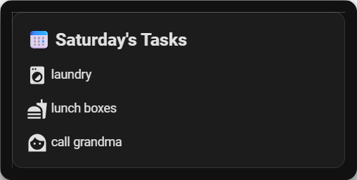
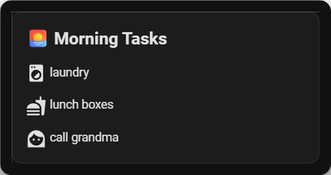
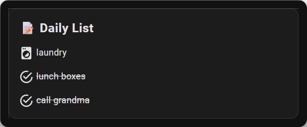

# Weeklies for Home Assistant 🗓️


[](https://github.com/hacs/integration)
[](https://github.com/emacholdt/weeklies/releases)
[](https://www.buymeacoffee.com/brusselssprites)

**Weeklies** is a custom Home Assistant integration designed to help families manage weekly recurring tasks and reminders. 

1.  Open HACS in Home Assistant.
2.  Go to **Integrations** > **Top right menu** > **Custom repositories**.
3.  Add `https://github.com/emacholdt/weeklies` with category **Integration**.
4.  Click **Install**.
5.  Restart Home Assistant.

### Option 2: Manual
1.  Download the latest release.
2.  Copy the `custom_components/weeklies` folder to your `config/custom_components/` directory.
3.  Restart Home Assistant.

## ⚙️ Configuration

1.  Go to **Settings** > **Devices & Services**.
2.  Click **Add Integration**.
3.  Search for **Weeklies**.
4.  Follow the prompts to add it.

## 🚀 Usage

### In the Dashboard
Add a **Todo List** card to your dashboard and select one of the `Weeklies` lists (e.g., `Weeklies Monday`). You can add and remove items directly from the UI.

## 📊 Dashboard Examples

### Dynamic Daily Card (Markdown)
This card automatically shows the tasks for the current day, including your custom icons. It's cleaner than the Todo card for a "read-only" view.


```yaml
type: markdown
content: >
  ## 📅 {{ now().strftime('%A') }}'s Tasks
  
  
  
    
    <ha-icon icon="{{ item.icon | default('mdi:checkbox-blank-circle-outline') }}"></ha-icon> {{ item.text }}
    
  
    *No tasks for today!* 🎉
  
```

### Morning Routine (Conditional Card)
This example uses a [Conditional Card](https://www.home-assistant.io/dashboards/conditional/) to only show your morning tasks when a specific condition is met. This is cleaner because it completely hides the card (including borders) when not needed.

**Prerequisite:** You need a binary sensor that is "on" during the morning. You can easily create this in your `configuration.yaml`:

```yaml
# configuration.yaml
binary_sensor:
  - platform: tod
    name: Morning
    after: "05:00:00"
    before: "12:00:00"
```

**Card Configuration:**

```yaml
type: conditional
conditions:
  - entity: binary_sensor.morning # Replace with your Time of Day sensor
    state: "on"
card:
  type: markdown
  content: >
    ## 🌅 Morning Tasks
    
    
    
      
    <ha-icon icon="{{ item.icon | default('mdi:checkbox-blank-circle-outline') }}"></ha-icon> {{ item.text }}
      
    
      *No tasks for this morning.*
    
```

### Advanced Dashboard Examples

#### Hide Completed Items
This card filters out items that have been marked as "completed" in the Todo list, showing only what's left to do.

```yaml
type: markdown
content: >
  ## 📝 To Do
  
  
  
    
      
    <ha-icon icon="{{ item.icon | default('mdi:checkbox-blank-circle-outline') }}"></ha-icon> {{ item.text }}
      
    
  
    *No tasks found.*
  
```

#### Strikethrough Completed Items
This card shows all items but crosses out the ones that are completed.

```yaml
type: markdown
content: >
  ## 📝 Daily List
  
  
  
    
      
    <ha-icon icon="mdi:checkbox-marked-circle-outline"></ha-icon> <s>{{ item.text }}</s>
      
    <ha-icon icon="{{ item.icon | default('mdi:checkbox-blank-circle-outline') }}"></ha-icon> {{ item.text }}
      
    
  
    *No tasks found.*
  
```

## 🛠️ Services

**`weeklies.add_item`**
Add an item with an optional icon (icons are visible in sensor attributes).
```yaml
service: weeklies.add_item
data:
  day: monday
  text: "Gym"
  icon: "mdi:dumbbell"
```

**`weeklies.remove_item`**
Remove an item.
```yaml
service: weeklies.remove_item
data:
  day: monday
  text: "Gym"
```

## 📸 Screenshots

| Daily View | Morning Routine | Advanced Strikethrough |
|:---:|:---:|:---:|
|  |  |  |
| *Standard Markdown Card* | *Conditional Morning Card* | *Strikethrough Completed* |

## ❤️ Contributing
Issues and Pull Requests are welcome!

## 📄 License
MIT License
